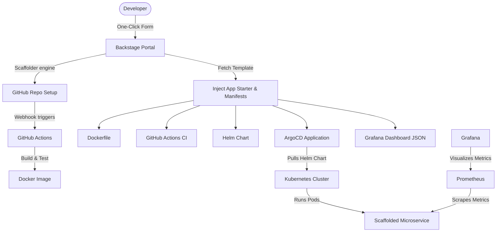

# 🚀 DevLaunch IDP: Enterprise Internal Developer Platform (IDP) Mini-Demo

An advanced, forward-looking Internal Developer Platform (IDP) built on **Spotify's Backstage** portal framework. This platform automates the developer experience by offering one-click self-service infrastructure and service provisioning, mimicking platform engineering setups seen in 2026 at organizations like Mercedes-Benz Tech Innovation, SAP, Trivago, and Otto.

---

## 🛠️ Architecture Overview

The platform uses a GitOps and Infrastructure-as-Code (IaC) model to bridge the developer portal to local Kubernetes clusters.



---

## ⚡ Key Features

* **One-Click Scaffolding**: Provision GitHub repository, Express.js microservice, Dockerfile, Helm Chart, ArgoCD Application, and Grafana dashboard in seconds.
* **GitOps-Driven Deployments**: Full GitOps integration where ArgoCD automatically tracks, pulls, and deploys the Helm chart directly to Kubernetes.
* **Out-of-the-Box Observability**: Express.js microservice pre-instrumented with `prom-client` to expose `/metrics`, scraped automatically by Prometheus, and ready for Grafana visualization.
* **Infrastructure Automation**: Simple PowerShell script to orchestrate local Kubernetes (Kind) creation, ArgoCD deployment, and Prometheus+Grafana monitoring stack setup.

---

## 🧰 Technology Stack

* **Portal**: Spotify's Backstage (React Frontend, Node.js Backend)
* **SCM**: GitHub (Git)
* **CI/CD**: GitHub Actions
* **Containers**: Docker Desktop & Kind (Kubernetes in Docker)
* **GitOps**: ArgoCD (Helm-driven GitOps controller)
* **Monitoring & Observability**: Prometheus Operator & Grafana

---

## 🚀 Getting Started (Step-by-Step)

### 1. Prerequisites
Ensure you have the following installed and running:
* **Node.js** (v20 or newer)
* **Docker Desktop** (Make sure the Docker daemon is fully started and running)
* **Windows PowerShell** (Run as Administrator for automatic dependency installation)

### 2. Configure GitHub Authentication (PAT)
The IDP template requires a GitHub Personal Access Token (PAT) with `repo` and `workflow` scopes to create repos and upload workflows.
1. Create a Classic PAT on GitHub with `repo` and `workflow` permissions.
2. In the project root, create a file named `app-config.local.yaml` and add:
   ```yaml
   integrations:
     github:
       - host: github.com
         token: ghp_YourGitHubTokenHere
   ```

### 3. Provision Infrastructure (Kubernetes + GitOps + Monitoring)
Open PowerShell (as Administrator) in the repository root and run:
```powershell
./setup-infra.ps1
```
This script will automatically:
1. Verify/install `kind` and `helm` via `winget`.
2. Boot a local Kubernetes cluster named `idp-demo`.
3. Install **ArgoCD** into the `argocd` namespace.
4. Install **Prometheus & Grafana** into the `monitoring` namespace.

### 4. Run the Backstage Portal
Install packages and start the portal:
```powershell
# Install dependencies
node .yarn/releases/yarn-4.4.1.cjs install

# Start development server
node .yarn/releases/yarn-4.4.1.cjs start
```
Once you see `Compiled successfully` in the terminal, open:
👉 **`http://localhost:3000/create`**

---

## 📊 Accessing the Dashboards

To access the control plane dashboards locally, run these port-forwarding commands in separate terminals:

### ArgoCD GitOps
```powershell
kubectl port-forward -n argocd svc/argocd-server 8080:443
```
* **URL**: `https://localhost:8080` (Username: `admin`)
* **Retrieve Password**:
  ```powershell
  kubectl -n argocd get secret argocd-initial-admin-secret -o jsonpath="{.data.password}" | %{[System.Text.Encoding]::UTF8.GetString([System.Convert]::FromBase64String($_))}
  ```

### Grafana Monitoring
```powershell
kubectl port-forward -n monitoring svc/kube-prometheus-stack-grafana 3001:80
```
* **URL**: `http://localhost:3001` (Username: `admin`, Password: `admin`)
